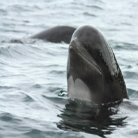

# KPWhale

This project was implemented as a proof of concept to demonstrate the utility of deep neural networks models to a bioacoustics lab. Unfortunately, I'm not able to share the data, but the code is under GPLv3.

They had a collection of 15,000 audio clips in AWS buckets server. Each clip was approximately 3 seconds long and contained the sound (or "call") produced by either a Killer Whale or Pilot Whale. Each call was also associated with individual whales, which had an unique id.

  

I chose two tasks:

1) To distinguish between Pilot and Killer whales (using a ResNet) and
2) To determine whether 2 killer whale calls were produced by the same individual (using a siamese CNN)

The pipeline included:
* Downloading the audio files from the server

  `download_data.py`
* Pre-processing each file to create an [spectrogram](https://en.wikipedia.org/wiki/Spectrogram) and storing the processed samples in a [HDF5](https://www.hdfgroup.org/solutions/hdf5/) database

  `create_db.py` and `create_sp_db.py`
* Implementing and training the Neural Networks

  `ResNet_sp.py` and `siamese_cnn_ind_kw.py`
  
`batch_gen.py` contains two classes to read data from the HDF5 database and serve it in batches to the neural networks.
These classes are very handy when dealing with large amounts of data. Since HDF5 databases are quite efficient to read from and query, this is a good way of only bringing one batch at a time to memory.
  

The ResNet achieved an accuracy of *98.44%* on the test set and the Siamese CNN achieved *94.6%*.
